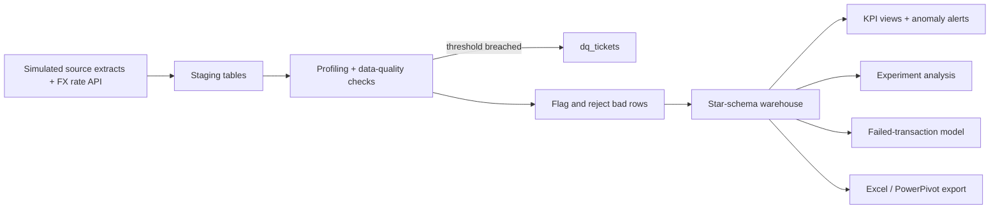
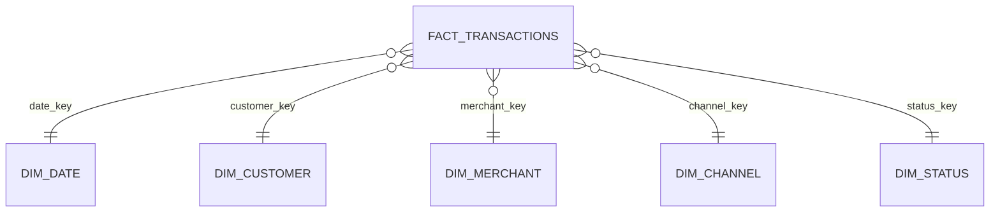

# Payments Data Warehouse Pipeline

An end-to-end analytics pipeline for bank payment data, built to run on a laptop. It ingests an exchange rate from a REST API, cleans messy transaction data, loads it into a star-schema data warehouse, tests data quality (and opens support tickets when tests fail), defines business metrics in SQL, monitors them for anomalies, analyses a product experiment, and trains a failed-transaction model.

> **Data note:** the transactions are **simulated** (about 176,000 records across 5,000 customers and 300 merchants, June to September 2026). Data-quality problems, a three-day outage, and an experiment effect were built in on purpose so the pipeline has something to detect. Nothing here is real bank data. The USD/GHS exchange rate is the one live input, fetched from a public API.

## Pipeline



## Star schema



The fact table holds one row per valid transaction (amount in local currency and in GHS, fee, failed/reversed flags). Dimensions describe customers, merchants, channels, dates, and statuses.

## What the notebook does and what it found

**1. REST API ingestion.** Pulls the live USD/GHS rate (11.64 in the recorded run) and uses it to convert dollar card payments to cedis. If the API is unreachable, it falls back to a clearly labelled placeholder rate.

**2. Data-quality tests, tickets, and reconciliation.** Seven checks run on the staging data against thresholds. Four failed and each opened a ticket in a `dq_tickets` table (priority P1 for critical, P2 for high).

| Check | Failing rows | Share | Threshold | Result |
|---|---|---|---|---|
| Duplicate transaction IDs | 875 | 0.50% | 0.10% | FAIL (P1) |
| Missing customer ID | 512 | 0.29% | 0.10% | FAIL (P2) |
| Non-positive amount | 186 | 0.11% | 0.05% | FAIL (P2) |
| Unknown merchant | 350 | 0.20% | 0.10% | FAIL (P2) |
| Future timestamp | 169 | 0.10% | 0.20% | PASS |
| Invalid currency | 191 | 0.11% | 0.20% | PASS |
| Invalid status | 0 | 0.00% | 0.00% | PASS |

Each bad row gets one reject reason and goes to a reject table. A reconciliation then proves nothing was lost: **175,955 staged rows = 173,682 loaded + 2,273 rejected.**

**3. KPI definitions in SQL.** Success rate, failure rate, transaction value (GMV), fee revenue, average ticket, and active customers are defined once in views, so every report uses the same logic.

**4. Monitoring.** A binomial z-score on each channel's daily failure rate, against a pooled 14-day baseline, with guards for low volume and small changes. It flagged the built-in mobile-money outage on 14 to 16 August (failure rate about 25% against a baseline of 5 to 8%) and raised no false alarms on any other channel or day.


**5. MapReduce-style aggregation.** A map, combine, and reduce implementation in pure Python computes per-merchant totals and matches SQL `GROUP BY` exactly for all 300 merchants.

**6. Experiment analysis.** A new mobile-money retry flow was randomised by customer (2,134 control, 2,161 treatment; sample-ratio check p = 0.68, so no sign of assignment problems).

| | Control | Treatment | Difference |
|---|---|---|---|
| Mobile-money failure rate | 4.97% | 3.58% | -1.39 points (about 28% lower) |

The customer-level bootstrap 95% interval for the difference is -1.97 to -0.78 points, which excludes zero. Resampling customers, the unit that was randomised, avoids overstating certainty the way a transaction-level test can.

**7. Failed-transaction model.** A gradient-boosting model trained on transactions before 1 September and tested on the rest (39,177 rows, 4.39% failure rate) reached a test AUC of 0.59 and a top-decile lift of 1.53x. Channel is by far the strongest feature. The model is modest by design of the simulation, and the notebook reports it as such.

**8. Excel export.** Dimensions, an aggregated fact summary, quality results, alerts, and KPI definitions are written to a workbook that can be loaded into PowerPivot.

## Limitations
- Simulated data; the outage, experiment effect, and quality problems were planted, so detecting them shows the method works, not what a real bank's data looks like.
- SQLite stands in for a production warehouse. The SQL is plain, but it has not been run on MySQL or Oracle.
- The MapReduce cell shows the pattern in one Python process. It is not Hadoop or Hive.
- One exchange-rate snapshot is applied to all dates; a production pipeline would store daily rates.
- The failure model is weak (AUC 0.59) and uses only warehouse features.

## Run it
```bash
pip install -r requirements.txt
jupyter notebook payments_data_warehouse.ipynb
```
Set `QUICK=1` in the environment (or `QUICK = True` in the config cell) for a much smaller, faster run. The notebook creates `payments_dw.db` (the warehouse) and `payments_dw_powerpivot.xlsx` in the working folder.

## Repository contents
- `payments_data_warehouse.ipynb`: the full pipeline
- `reports/dq_results.csv`, `reports/reject_reasons.csv`, `reports/kpi_alerts.csv`: quality results, reject counts, and alerts from the recorded run
- `reports/failure_rate_monitoring.png`: daily failure rate by channel with alerts marked

**Tools:** Python, SQL (SQLite), pandas, SciPy, scikit-learn, matplotlib, requests, openpyxl
